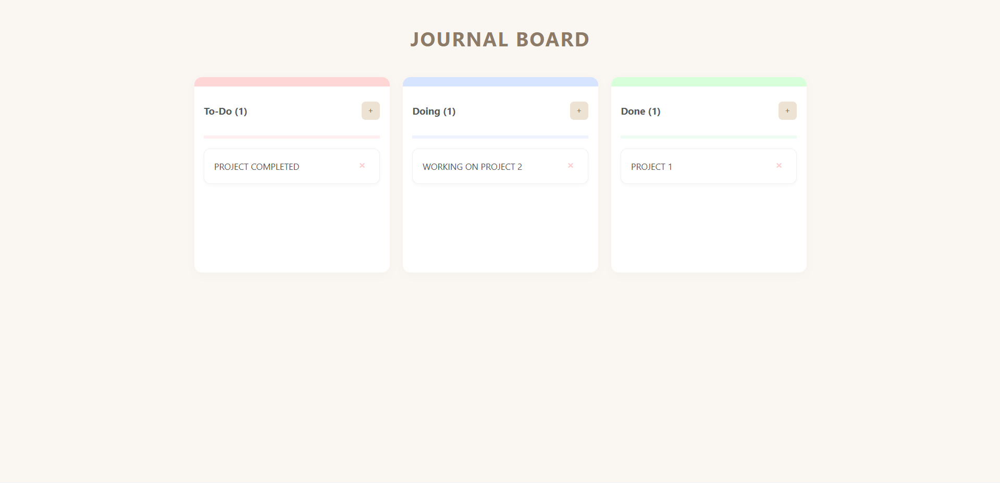

# Project 2 - Kanban Board

A highly functional and interactive Kanban Board for task management.  
Built using vanilla JavaScript, this project allows users to organize their workflow by dragging and dropping tasks across different stages of completion.

---

## 📸 Preview

  

---

## 📌 Features

- 🖱️ **Drag & Drop**: Move task cards seamlessly between columns (To-Do, Doing, Done) using the Native JavaScript Drag and Drop API.
- 📋 **Task Management**: Easily add new tasks or remove them with dedicated buttons.
- 💾 **Persistent Storage**: Uses `localStorage` to save your board state, so your tasks won't disappear after a page refresh.
- 🎨 **Color Coding**: Visual cues and simple color coding for each column.
- 📱 **Responsive Layout**: Adapts perfectly to various screen sizes with a neat and clean design.

---

## ⚙️ How It Works

- **Adding/Removing**: Users can dynamically create new task cards or delete them using specific action buttons.
- **Drag & Drop Logic**: 
  - Each card is marked as `draggable="true"`.
  - Uses `dragstart`, `dragover`, and `drop` event listeners to handle card transitions.
- **State Management**: Every update (add, move, or delete) is automatically synchronized with `localStorage`.
- **UI Updates**: The layout uses Flexbox or CSS Grid to ensure columns stay organized and responsive.

---

## 🛠 Tech Stack

- **HTML5**: Semantic structure for columns and cards.
- **CSS3**: Custom styling, responsive layout, and transitions.
- **JavaScript**: Drag and Drop API and LocalStorage integration.

---

## 👩‍💻 Author

Created by **Ummu Husnul**
